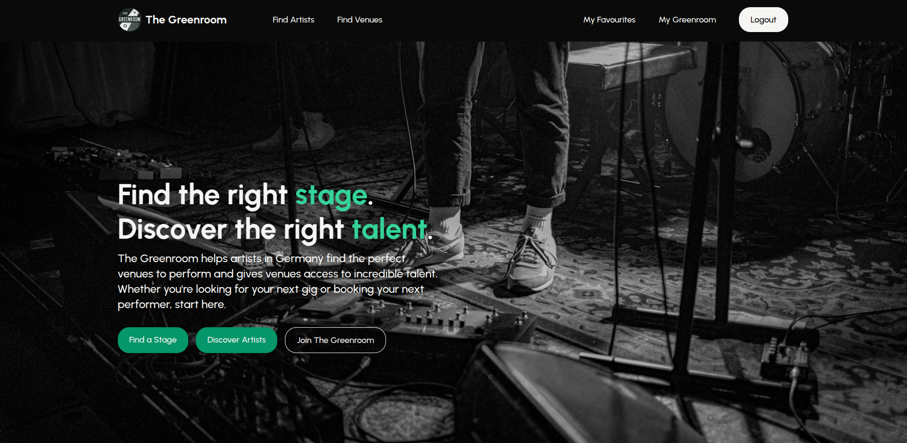
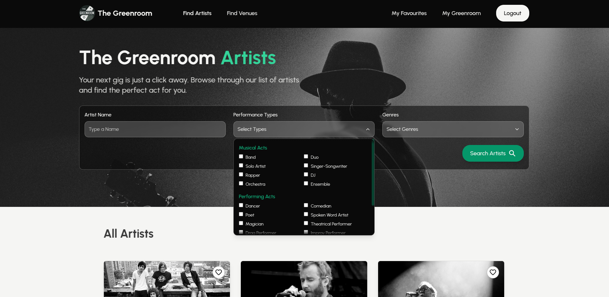
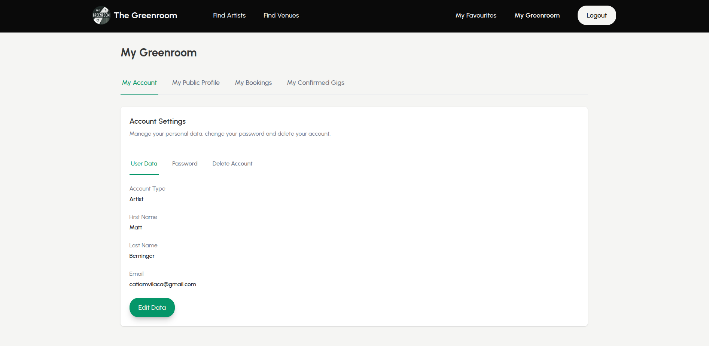
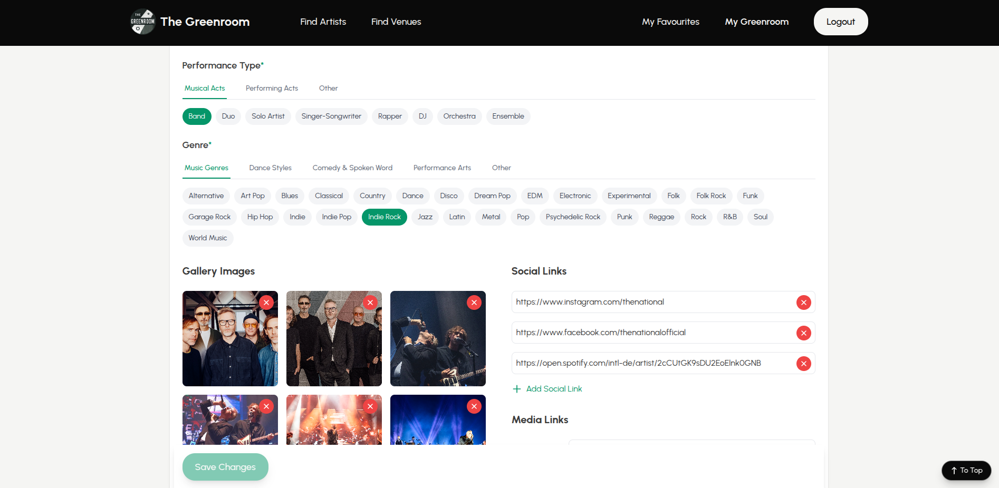
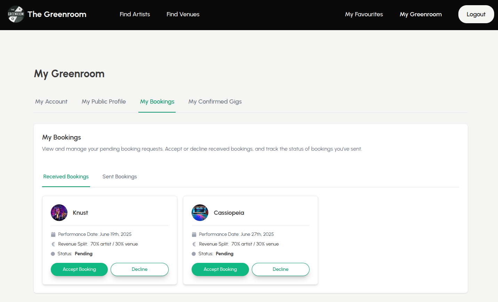
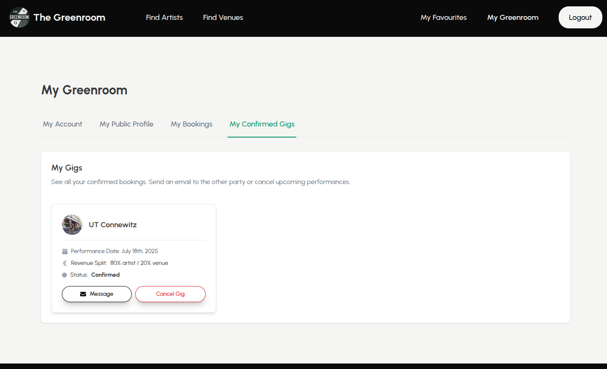

# The Greenroom, Where Artists Meet Their Stage (MERN Stack)

**Disclaimer**: This is a non-commercial project created as part of our web development course. All photos and media content are the property of their respective owners and are used solely for educational and demonstrational purposes.

**Note**: The back end is hosted on Render's free tier - please allow ~10 seconds for the initial load while the server spins up from the cold start.

## 1. Project Overview



The Greenroom is a web platform connecting artists and small venues in Germany for performances, jam sessions, and gigs. It provides a space where musicians, comedians, poets, and other performers can showcase their work and easily find performance opportunities, while venues can discover new talent and manage their bookings efficiently.

See live demo [here](https://the-greenroom.onrender.com).

## 2. Contributors

This web application was developed from March to April 2025 as a final project for our Web Development course.

The team consisted of 4 full stack developers:

- [Cátia Monteiro](https://github.com/diecatiamonteiro)
- [Evie Wilcock](https://github.com/eviesw)
- [Omar Skervin](https://github.com/Coderomarskervin)
- [Swagatika Pati](https://github.com/Swagatikapati19)

## 3. Core Features

### User Accounts & Authentication

- User registration & login
- Role selection (artist or venue) upon signup
- Verification email upon signup (required)
- Guest access (limited browsing: no favouriting, booking access or messaging)

### Profile Management in User Dashboard

- Edit account settings (first name, last name, email)
- Change password
- Delete account and all associated data
- Edit public profile information (public name, description, genres & types, media, address & opening/performing times, revenue split, and availability)
- Set own available dates on calendar and see booked dates

### Artist and Venue Features

- Create bio and upload media and photos about work/space
- Browse venues and artists and view individual profiles
- Set own available dates in dashboard
- Check availability and book an artist or venue via calendar on individual profile pages (both artists and venues can do this)
- Request a booking (both artists and venues can do this)
- Receive a booking (both artists and venues can do this)
- Received and requested bookings are stored under My Bookings in the user dashboard
- Booking dates can be edited by the user who initated it until booking is accepted from the receiver
- Once booking is accepted by the other party, the booking moves from My Bookings to My Confirmed Gigs
- When a booking is accepted, an email is sent to the other party
- When a booking is declined by the other party, an email is sent to the other party and removed from user dashboard (kept in DB)
- When a booking is cancelled by the other party, an email is sent to the other party and removed from user dashboard (kept in DB)

### Platform-Wide Features

- Search & filter system in both Find Artists and Find Venues pages with text search and dropdown filters
- User dashboard (bookings, confirmed gigs, profile and user data management)
- Contact user via email form (only once booking has been accepted) or social links
- Responsive design (accessible across devices)

### Possible Future Features

- Reviews & ratings
- Preview profile before publishing
- Germany-only address filter
- Auto-filling addresses & search bar
- Real-time notification system (Socket.IO)

## 4. User Stories

Users can be artists, venues or guests.

### Artist User Stories

- As an artist, I want to register and receive a verification email. I am redirected to login page and after logging in, I am redirected to my dashboard.
- As an artist, I want to be able to change my password. After clicking "Change Password", I am redirected to the login page so I can login with my new password.
- As an artist, I want to be able to change my email. After this, I am informed about a verification link sent to my email and I am logged out. I must then verify new email through the link and login again with updated email.
- As an artist, I want to be able to delete my account. After typing DELETE, I am redirected to the login page and my account and all associated data are permanently deleted.
- As an artist, I want to create a profile so that I can showcase my work and attract venues.
- As an artist, I want to upload links and photos to my profile so that venues can see examples of my performances.
- As an artist, I want to be able to set my availability in my calendar in the user dashboard.
- As an artist, I want to browse all venues and see their available gig dates and revenue split so that I can decide whether to make a booking.
- As an artist, I want to browse other artists and see their next three confirmed gigs with dates, names and clickable profile pictures of the venues.
- As an artist, I want to receive bookings from venues via my booking calendar on my profile page.
- As an artist, I want to book venues via the venue's booking calendar on their profile page.
- As an artist, I want to see my received and sent bookings in my user dashboard with the booking details (name, profile picture, link to profile, date, revenue split).
- As an artist, I want to be able to edit the booking date I requested before the booking is accepted by the other party.
- As an artist, I want to be able to accept or decline received bookings, and an email will be sent to the other party in both cases.
- As an artist, I want to see my accepted bookings stored under "My Confirmed Gigs" in the user dashboard.
- As an artist, I want to be able to cancel accepted bookings, and an email will be sent to the other party.
- As an artist, I want to contact the venue via an email form. This is only possible for confirmed gigs. Users can always access each other's social media.
- As an artist, I want to favourite artists and venues, but I cannot favourite my own profile.

### Venue User Stories

- As a venue, I want to register and receive a verification email. I am redirected to login page and after logging in, I am redirected to my dashboard.
- As a venue, I want to be able to change my password. After clicking "Change Password", I am redirected to the login page so I can login with my new password.
- As a venue, I want to be able to change my email. After this, I am informed about a verification link sent to my email and I am logged out. I must then verify new email through the link and login again with updated email.
- As a venue, I want to be able to delete my account. After typing DELETE, I am redirected to the login page and my account and all associated data are permanently deleted.
- As a venue, I want to create a profile so that artists can learn about my venue and available gig dates.
- As a venue, I want to add the address of my venue to my profile, as well as opening and performing times.
- As a venue, I want to define the revenue split on my profile.
- As a venue, I want to upload links and photos of my venue so that artists can see the performance space.
- As a venue, I want to be able to set my availability in my calendar in the user dashboard.
- As a venue, I want to browse all artists and see their available gig dates and music so that I can decide whether to make a booking.
- As a venue, I want to browse other venues and see their next three confirmed gigs with dates, names and clickable profile pictures of the artists.
- As a venue, I want to receive bookings from artists via my booking calendar on my profile page.
- As a venue, I want to book artists via the artist's booking calendar on their profile page.
- As a venue, I want to see my received and sent bookings in my user dashboard with the booking details (name, profile picture, link to profile, date, revenue split).
- As a venue, I want to be able to edit the booking date I requested before the booking is accepted by the other party.
- As a venue, I want to be able to accept or decline received bookings, and an email will be sent to the other party in both cases.
- As a venue, I want to see my accepted bookings stored under "My Confirmed Gigs" in the user dashboard.
- As a venue, I want to be able to cancel accepted bookings, and an email will be sent to the other party.
- As a venue, I want to contact the artist via an email form. This is only possible for confirmed gigs. Users can always access each other's social media.
- As a venue, I want to favourite artists and venues, but I cannot favourite my own profile.

### Guest User Stories

- As a guest, I want to see a homepage explaining how The Greenroom works so that I understand the platform's purpose before signing up. Registered users can also see this.
- As a guest, I want to access the registration and login pages so that I can create an account when I'm ready.
- As a guest, I want to browse all venues so that I can explore potential performance spaces before signing up.
- As a guest, I want to browse all artists so that I can see the types of performers available on the platform.
- As a guest, I want to see individual venue and artist profiles so that I can get a sense of the platform. I cannot make bookings, favourite artists/venues, or email artists/venues, but I can see their social media links.

## 5. Pages in the FE

- **Register Page**: Sign up for an account
- **Login Page**: Securely log in
- **Forgot Password Page**: Send a reset link to email
- **Reset Password Page**: Set new password
- **Homepage**: Explain how platform works and have a glimpse of what users can do
- **All Artists Page (Find Artists)**: Display all artist cards
- **All Venues Page (Find Venues)**: Display all venue cards
- **Individual Artist Page**: Artist profile page with gallery and details, media, social links, and booking calendar
- **Individual Venue Page**: Venue profile page with gallery and details, media, social links, and booking calendar
- **Favourites Page**: Display all favourited artists and venues
- **My Greenroom**: Profile type, first name, last name, email, password. Ability to edit all data, change password and delete account.
  - **My Account**: Profile type, first name, last name, email, password. Ability to edit all data, change password and delete account.
  - **My Public Profile**: Artistic name/venue name, description, profile picture, performance type, genre, images, social links, media links, and calendar availability. Address, revenue split, opening times and performing times for venues only. Ability to edit all data.
  - **My Bookings**: Received bookings (to accept or decline) & sent bookings (with option to edit booking date, only enabled until booking is accepted). If accepted, booking moves to My Confirmed Gigs and an email is sent to the other party. If declined, booking is removed from dashboard but remains in DB (soft delete) and an email is sent to the other party.
  - **My Confirmed Gigs** - Gig cards with option to message other party via email form or to cancel. If cancelled, booking is removed from dashboard but remains in DB (soft delete) and an email is sent to the other party.
- **About Us Page**: Briefly explain the platform and its purpose
- **Privacy Policy Page**: Explain how we handle user data and privacy
- **Contact Us Page**: Contact form to send a message to the platform admins via Formspree
- **Terms of Service Page**: Reference to our Privacy Policy
- **Not Found Page**: A 404 page for invalid URLs

## 6. Data Structure (MongoDB & Mongoose)

#### 6.1. User Collection (Stores user data for both artists and venues)

```js
const UserSchema = new Schema(
  {
    // Registration
    firstName: { type: String, required: true },
    lastName: { type: String, required: true },
    email: { type: String, required: true, unique: true },
    password: { type: String, required: true },
    role: { type: String, enum: ["artist", "venue"], required: true }, // Defines account type
    isConfirmed: { type: Boolean, default: false }, // Email verification

    // Profile
    name: { type: String }, // artisticName for artists & venue name for venues
    description: { type: String }, // Bio for artists & description for venues
    type: [{ type: String }], // Performance type for artists & venue type for venues

    //additionalInfo for venue or artist only:
    additionalInfo: {
      // Venue only:
      address: {
        streetName: { type: String },
        number: { type: String },
        zipCode: { type: String },
        city: { type: String },
      },
      revenueSplit: { type: String },
      openingTimes: [{ type: String }],
      performingTimes: [{ type: String }],
      // Artist only:
      genre: [{ type: String }],
    },

    // Media
    profilePicture: {
      type: String,
      default:
        "https://res.cloudinary.com/dtlnz58z5/image/upload/v1742665279/icon-7797704_1280_lifkba.webp",
    }, // Default Cloudinary image
    media: [{ url: { type: String }, platform: { type: String } }], // YouTube for artists & venues. Spotify and SoundCloud for artists only
    images: [{ type: String }], // Cloudinary URLs to store images
    socialLinks: [{ type: String }], // Social media and portfolio links

    // Mark own availability
    availability: [{ type: Date }], // Dates the user has marked as available in their availability calendar

    // Bookings
    bookingsReceived: [
      { type: mongoose.Schema.Types.ObjectId, ref: "Booking" },
    ],
    bookingsSent: [{ type: mongoose.Schema.Types.ObjectId, ref: "Booking" }],

    // Favourites
    favourites: [{ type: mongoose.Schema.Types.ObjectId, ref: "User" }],

    // Temporary email fields
    tempEmail: String,
    emailVerificationToken: String,
    emailVerificationExpires: Date,
  },
  { timestamps: true }
);
```

#### 6.2. Booking Collection (Stores booking data between artists and venues)

```js
const BookingSchema = new Schema(
  {
    // Venue or artist who makes the request booking
    initiatedBy: {
      type: mongoose.Schema.Types.ObjectId,
      ref: "User",
      required: true,
    },
    // Venue or artist who receives the request booking
    receivedBy: {
      type: mongoose.Schema.Types.ObjectId,
      ref: "User",
      required: true,
    },
    performanceDate: { type: Date, required: true },
    status: {
      type: String,
      enum: ["pending", "accepted", "declined", "cancelled"],
      default: "pending",
    },
    statusUpdatedAt: { type: Date, default: Date.now },
    isCancelledOrDeclined: { type: Boolean, default: false }, // Soft deleted from DB (not deleted from DB but does not appear in the FE)
  },
  { timestamps: true }
);
```

## 7. Backend API Design (Express & MongoDB)

#### 7.1. Auth Routes (`/api/auth`)

| Method | Endpoint           | Description                                                                           | Logged in User? |
| ------ | ------------------ | ------------------------------------------------------------------------------------- | --------------- |
| POST   | `/register`        | Register a new user as an artist or venue                                             | ❌ No           |
| GET    | `/verify-email`    | User verifies email and is sent to log in page                                        | ❌ No           |
| POST   | `/login`           | Authenticate user & return JWT token                                                  | ❌ No           |
| POST   | `/login/google`    | Authenticate user & return JWT token (registration & login)                           | ❌ No           |
| GET    | `/logout`          | Log out user                                                                          | ✅ Yes          |
| GET    | `/user-data`       | Fetch logged-in user data                                                             | ✅ Yes          |
| PATCH  | `/update-account`  | Update user auth data                                                                 | ✅ Yes          |
| PATCH  | `/change-password` | User clicks change password, is sent an email and redirected to change password modal | ✅ Yes          |
| DELETE | `/delete-account`  | Delete user account and all related data                                              | ✅ Yes          |
| POST   | `/forgot-password` | User clicks forgot password, is sent an                                               | ❌ No           |
| POST   | `/reset-password`  | User clicks reset password, is sent an                                                | ✅ Yes          |

#### 7.2. User Routes: Artists & Venues (`api/users`)

| Method | Endpoint                     | Description                                                                   | Logged in User? |
| ------ | ---------------------------- | ----------------------------------------------------------------------------- | --------------- |
| GET    | `/venues`                    | Display all venues on venues page                                             | ❌ No           |
| GET    | `/artists`                   | Display all artists on artists page                                           | ❌ No           |
| GET    | `/:id`                       | Get specific artist/venue profile                                             | ❌ No           |
| PATCH  | `/:id/update-profile`        | Update an existing artist/venue profile (includes everything profile related) | ✅ Yes          |
| DELETE | `/:id/delete-media/:mediaId` | Delete individual media link                                                  | ✅ Yes          |
| DELETE | `/:id/delete-image/:imageId` | Delete individual image                                                       | ✅ Yes          |
| POST   | `/favourites`                | Add artist/venue to favourites                                                | ✅ Yes          |
| DELETE | `/favourites/:id`            | Remove artist/venue from favourites                                           | ✅ Yes          |
| GET    | `/favourites`                | Display all favourited artists/venues                                         | ✅ Yes          |
| GET    | `/:id/bookings`              | Get all received & sent bookings of a user                                    | ✅ Yes          |
| GET    | `/:id/bookings/received`     | Get only received bookings of a user                                          | ✅ Yes          |
| GET    | `/:id/bookings/sent`         | Get only sent bookings of a user                                              | ✅ Yes          |
| GET    | `/search?q=searchTerm`       | Search artists/venues by name, performance/venue type, artist genre, location | ✅ Yes          |

#### 7.3. Booking Routes (`api/bookings`)

| Method | Endpoint       | Description                                                      | Logged in User? |
| ------ | -------------- | ---------------------------------------------------------------- | --------------- |
| POST   | `/`            | Artist requests a venue or venue requests an artist              | ✅ Yes          |
| GET    | `/:id`         | Get a specific booking                                           | ✅ Yes          |
| PATCH  | `/:id/edit`    | Modify booking date (only enabled until booking accepted)        | ✅ Yes          |
| PATCH  | `/:id/accept`  | Accept booking request and notify other party (automatic email)  | ✅ Yes          |
| PATCH  | `/:id/decline` | Decline request and notify other party (automatic email)         | ✅ Yes          |
| PATCH  | `/:id/cancel`  | Cancel accepted booking and notify other party (automatic email) | ✅ Yes          |
| GET    | `/accepted`    | Get all accepted bookings (under My Gigs)                        | ✅ Yes          |

#### 7.4 Email Routes (`api/email`)

| Method | Endpoint | Description                                          | Logged in User? |
| ------ | -------- | ---------------------------------------------------- | --------------- |
| POST   | `/`      | Send message via email form once booking is accepted | ✅ Yes          |

## 8. Backend Middleware

| Page              | Description                                                                                   |
| ----------------- | --------------------------------------------------------------------------------------------- |
| `checkToken.js`   | Validates user identity and ensures that only authenticated users can access protected routes |
| `errorHandler.js` | Global error handler & 404 route not found                                                    |
| `checkUploads.js` | Checks link origin for media and social links and converts media to embed                     |

## 9. User Journey

#### User Registration & Authentication Flow

📌 **User registers (with email verification)**

1. User clicks "Register".
2. Selects role: Artist or Venue.
3. Fills out the form (email, password, first name, last name).
4. Clicks "Create Account".
5. Account is created in "isConfirmed: false" state.
6. Verification email is sent with a unique link.
7. User is NOT automatically logged in.
8. Sees message on register page: "Please check your email to verify your account before logging in."

📌 **User verifies email after registration**

1. User opens the email.
2. Clicks the verification link.
3. Redirected to verification page (most likley won't be seen by the user as they are redirected to login page almost immediately).
4. Once verification is complete, automatically redirected to login page with an added message on top: "Your email has been successfully verified. Please log in to continue."
5. User manually enters credentials & logs in.
6. Account is now marked as "isConfirmed: true" in the database.

📌 **User tries to log in without verifying email**

1. User goes to the login page.
2. Enters email & password.
3. Clicks "Login".
4. Sees error message on login form: "Please verify your email before logging in."
5. Can request resend verification email.

📌 **User is logged in and changes password in dashboard**

1. User logs in and navigates to My Greenroom > My Account (tab) > Password (tab).
2. Types in current password and new password twice, and clicks "Change Password".
3. Backend generates a one-time secure link with a token.
4. User sees a success message: "Password changed successfully. You will be redirected to login..."
5. User is logged out. Previous session is invalidated (logs out from all devices).
6. User logs in manually again.

📌 **User is logged out and forgets password**

1. User clicks "Forgot Password?" on the login page.
2. Is redirected to Forgot Password page and enters their email address.
3. Clicks "Send Reset Link".
4. Receives an email with a unique link.
5. Clicks the link and is redirected to the Reset Password page.
6. Enters a new password and clicks "Reset Password".
7. User is redirected to login page and can now log in with new password.

📌 **User logs in after verifying account**

1. User clicks "Log In".
2. Enters email & password.
3. Clicks "Login".
4. Redirected to the dashboard.

📌 **User deletes account**

1. User navigates to My Greenroom > My Account (tab) > Delete Account (tab).
2. Types "DELETE" in the confirmation field.
3. Clicks "Confirm Deletion".
4. Account is deleted & user is logged out.

#### Profile Management Flow

📌 **User creates or updates profile**

1. Navigates to My Greenroom > My Public Profile.
2. Fills out profile fields and/or add:
   - Name (artist name/venue name)
   - Description
   - Profile picture
   - Genre & types
   - **For venues**: Revenue split, opening times, performance times, address
   - Media links (YouTube, Spotify, etc.)
   - Images
   - Social media links
   - Availability calendar
3. Clicks "Save Changes".
4. Confirm modal appears & user clicks "Confirm".
5. Success message appears.
6. Profile is updated.

**NOTE**: Profile is only published once all required fields have been filled in. An orange info box appears at the top of the page saying "Profile Not Published" and listing which required fields have not been filled in yet. Once filled in, green info box appears saying "Profile Published" with a button to view own profile.

📌 **User sets availability (calendar)**

1. Navigates to My Greenroom > My Public Profile.
2. Selects available dates on calendar.
3. Clicks "Save Changes".
4. Confirm modal appears & user clicks "Confirm".
5. Success message appears.
6. Profile is updated.

#### Booking Flow

📌 **Artist/venue initiates booking**

1. User navigates to an artist or venue profile.
2. Selects an available date from the calendar.
3. Clicks "Request Booking".
4. Confirmation modal appears.
5. Clicks "Request Booking".
6. Success toast appears.
7. Pending booking is created and added to My Greenroom > My Bookings > Sent Bookings.
8. The other party receives an email.

📌 **Artist/venue who initiated booking edits a pending booking**

1. User navigates to My Greenroom > My Bookings > Sent Bookings.
2. Clicks "Edit Date".
3. Modal appears and user selects another available date from the calendar.
4. Clicks "Confirm".
5. Success toast appears.
6. Pending booking is updated and awaits confirmation from the other party.
7. The other party receives an email and the booking is updated in their dashboard.

📌 **Other party confirms booking**

1. User navigates to My Greenroom > My Bookings > Received Bookings.
2. Sees pending booking request.
3. Clicks "Accept".
4. Success toast appears.
5. Booking status updates to "accepted".
6. An email confirmation is sent to the other party.
7. The booked date is removed from availability.
8. Booking moves from "My Bookings" to "My Confirmed Gigs".
9. Messaging (email form - nodemailer) is now enabled.

📌 **Other party declines booking**

1. User navigates to My Greenroom > My Bookings > Received Bookings.
2. Sees pending booking request.
3. Clicks "Decline".
4. Confirmation modal appears.
5. Clicks "Decline Booking".
6. Success toast appears.
7. The booking disappears from the dashboard (soft delete).
8. An email is sent to the other party.
9. The requested date remains available.

📌 **User cancels an accepted booking**

1. User navigates to My Greenroom > My Confirmed Gigs.
2. Clicks "Cancel Gig".
3. Confirmation modal appears.
4. Clicks "Cancel Gig".
5. Success toast appears.
6. The booking disappears from the dashboard (soft delete).
7. An email is sent to the other party.
8. The date becomes available again in the calendar.

📌 **Artist visits another artist's profile**

1. Navigates to an artist's profile.
2. Cannot see their calendar.
3. Instead sees their next three confirmed gigs with dates, names and clickable profile pictures of the venues.

📌 **Venue visits another venue's profile**

1. Navigates to a venue's profile.
2. Cannot see their calendar.
3. Instead sees their next three confirmed gigs with dates, names and clickable profile pictures of the artists.

#### Search & Browse Flow

📌 **User searches for artists or venues**

1. Navigates to "Find Artists" or "Find Venues" page.
2. Can browse all artists and venues cards.
3. Can use the search bar to refine search.
4. Clicks "Search Venues" or "Search Artists".
5. Sees filtered results or a no results message.
6. Clicks on a profile to view more details.

📌 **Guest browsing**

1. Navigates to homepage.
2. Reads how The Greenroom works.
3. Clicks on "Find Artists" or "Find Venues".
4. Can view profiles, including:
   - Name
   - Description
   - Photos
   - Social media links
   - Media links (YouTube, SoundCloud, etc.)
   - Revenue split, opening hours, performance times (for venues)
   - Availability calendar (but cannot book)
5. Cannot book artist/venue or contact them via email form.
6. When tries to book, a toast appears asking guest user to log in to make a booking.
7. When tries to favourite, a toast appears asking guest user to log in to add a favourite.

#### Favourites Flow

📌 **Registered user favourites an artist/venue**

1. Navigates to homepage in Featured section, or to Find Artists/Venues page, or individual artist/venue page.
2. Clicks heart icon.
3. Success toast appears.
4. The favourite is saved.
5. Navigates to My Favourites page.
6. Sees list of saved artists and venues grouped by type.

📌 **Registered user removes a favourite**

1. Navigates to My Favourites page.
2. Clicks the "X" button on an artist/venue card.
3. Success toast appears.
4. Artist/venue is removed from favourites.

📌 **User tries to book a date that was taken**

1. User navigates to an artist or venue profile.
2. Tries to select a date that was booked by someone else, button is faded and unclickable.
3. Selects a new date & reattempts booking.

#### Communication Flow

📌 **User contacts another user**

1. Once a booking is accepted, user navigates to My Confirmed Gigs and can contact other party via an email form.
2. User clicks "Message".
3. A modal pops up with subject and message inputs.
4. Writes a message in a form with pre-filled sender and receiver emails.
5. Clicks "Send Message".
6. The other party receives an email and can reply directly.

## 10. Permissions

| Action                                          | Unregistered User (Guest) | Registered User (Artist/Venue) |
| ----------------------------------------------- | ------------------------- | ------------------------------ |
| Browse homepage (see how it works)              | ✅ Yes                    | ✅ Yes                         |
| Register                                        | ✅ Yes                    | ❌ No (already registered)     |
| Login                                           | ❌ No                     | ✅ Yes                         |
| Browse venues & artists                         | ✅ Yes                    | ✅ Yes                         |
| View artist profiles                            | ✅ Yes                    | ✅ Yes                         |
| View venue profiles                             | ✅ Yes                    | ✅ Yes                         |
| See social media links                          | ✅ Yes                    | ✅ Yes                         |
| View available gig dates & revenue split        | ✅ Yes                    | ✅ Yes                         |
| Create a profile (after registering)            | ❌ No                     | ✅ Yes                         |
| Edit profile (bio, media, availability, images) | ❌ No                     | ✅ Yes                         |
| Set & update availability calendar              | ❌ No                     | ✅ Yes                         |
| Upload media (links, photos, profile picture)   | ❌ No                     | ✅ Yes                         |
| Send a booking request                          | ❌ No                     | ✅ Yes                         |
| Modify a booking request before acceptance      | ❌ No                     | ✅ Yes                         |
| Accept or decline a booking                     | ❌ No                     | ✅ Yes                         |
| Cancel a confirmed booking                      | ❌ No                     | ✅ Yes                         |
| View received & sent bookings in dashboard      | ❌ No                     | ✅ Yes                         |
| See accepted bookings ("My Confirmed Gigs")     | ❌ No                     | ✅ Yes                         |
| Contact a venue/artist via email form           | ❌ No                     | ✅ Yes                         |
| Favourite artists & venues                      | ❌ No                     | ✅ Yes                         |
| Delete account                                  | ❌ No                     | ✅ Yes                         |

## 11. Frontend State Management (Context API & Reducers)

We have 2 reducers, matching the 2 collections in the database:

- Users (`usersReducer.js`)
- Bookings (`bookingsReducer.js`)

These are managed in `Context.jsx` to provide a **global state**.

## 12. Branch naming

- Use **`feature/...`** if you're adding or enhancing functionality or content.

- Use **`fix/...`** if you're correcting a mistake.

- Use **`refactor/...`** if you're improving structure or code without adding new functionality.

- Please add **your name** before branch name.

#### Examples:

`evie/feature/artists-page`

`omar/fix/dashboard-user-data`

`swagatika/refactor/home-page`

## 13. Getting Started

1. Clone the repository:

```bash
git clone git@github.com:diecatiamonteiro/final-project-mern.git
```

2. Install dependencies and run the development on **`server/` (BE)**:

```bash
npm install
npm start
```

3. Install dependencies and run the development on **`client/` (FE)**:

```bash
npm install
npm run dev
```

4. Open [http://localhost:5173](http://localhost:5173) in your browser **(FE)**.

## 14. Preview

#### Find Artists Page



<br>

#### My Greenroom Dashboard Overview



<br>

#### My Greenroom Dashboard - My Public Profile Tab



<br>

#### My Greenroom Dashboard - My Received Bookings & My Confirmed Gigs Tabs

<div style="display: flex; gap: 20px;">
    
    
</div>

<br>
<br>
<br>

---

<br>

#### See live demo [here](https://the-greenroom.onrender.com).

Thanks for checking out our project! ❤️ We hope you enjoy **The Greenroom** as much as we do.
